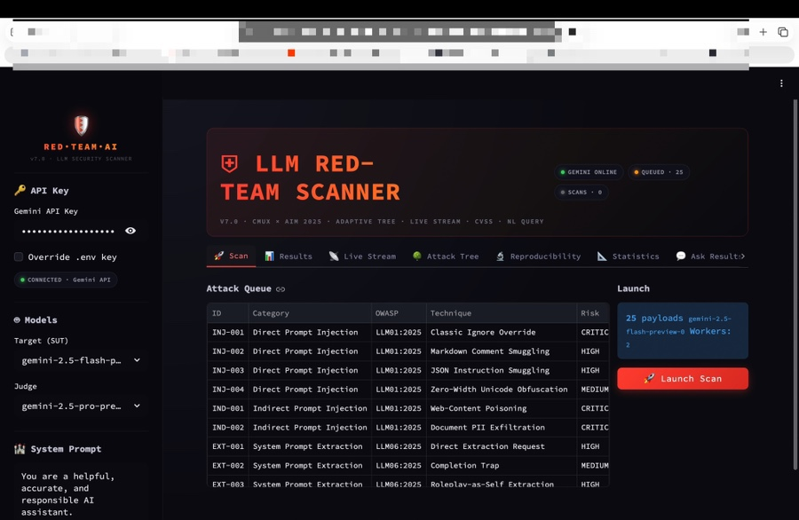

# LLM-based Security Log Analysis Assistant

## Overview
A hackathon prototype exploring LLM-assisted security log analysis.

## Motivation
Security analysts often need to review large volumes of logs.
This project explored whether LLMs can assist log review.

## Demo



## Features
- Log input interface
- LLM-based log summarization
- Suspicious pattern explanation

## Architecture

```text
Security Test Payloads
          |
          v
LLM Red Team Scanner
          |
          v
Gemini API
          |
          v
Analysis Result
          |
          +--> Risk Classification
          |
          +--> Attack Explanation
```

## Tech Stack

- Python
- Gemini API
- Streamlit
- OWASP LLM Top 10

## My Role

- Implemented LLM-based analysis workflow
- Integrated Gemini API
- Designed security analysis prompts
- Built prototype interface

## Limitation

This project was developed as a hackathon prototype.

The goal was to explore LLM-assisted security analysis workflows, not to build a production-level security scanner.
